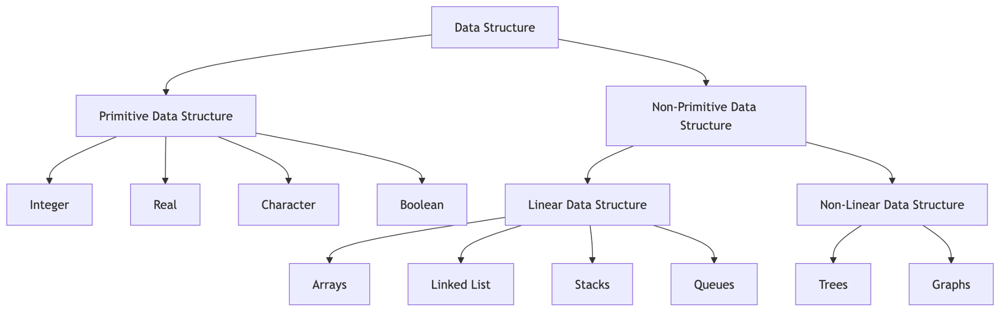
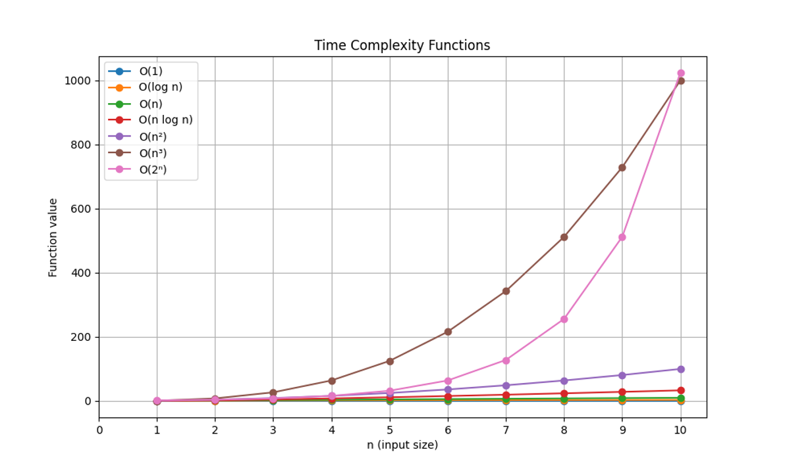

# Data Structures: Introduction

## Data Structures
A data structure (DS) is a way of organizing data so that it can be used effectively.

## Classification of Data Structures
### Static Data Structures
- It is a data structure with a fixed memory size and is easier to access.
### Dynamic Data Structures
- Here, the size of memory is not fixed.
- Additionally, it can be randomly updated while the program is running, which is efficient given how memory-intensive the code is.

## Data Structure Operations
### Core Operations
- **Create**: Allocate memory or initialize the data structure (e.g., create an array, initialize a linked list, etc.).
- **Insert**: Add a new element to the data structure at a specific position or the next available slot.
- **Read**: Access and retrieve an element from the data structure without modifying it.
- **Update**: Modify the value of an existing element in the data structure.
- **Delete**: Remove an element from the data structure, potentially shifting other elements to maintain order.

### Basic Operations
- **Access**: Retrieve an element from a specific index or position in the data structure.
- **Search**: Find the location of a specific element within the data structure.
- **Traverse**: Visit each element in the data structure sequentially to perform an operation or gather information.
- **Copy**: Create a duplicate of the data structure, preserving its elements and structure.
- **Swap**: Exchange the positions of two elements within the data structure.
- **Resize**: Adjust the size of the data structure to accommodate more or fewer elements.
- **Initialize**: Set up the data structure with default values or an initial state.
- **Compare**: Evaluate two data structures to determine if they are equal or satisfy specific criteria.

### Status Operations
- **isEmpty**: Determine if the data structure contains no elements.
- **isFull**: Check if the data structure has reached its maximum capacity (applicable to fixed-size structures like arrays, stacks, or queues).
- **Count**: Return the current number of elements stored in the data structure.
- **Capacity**: Provide the maximum number of elements the data structure can hold (for fixed-size structures).
- **Clear**: Remove all elements from the data structure without deallocating its memory.
- **isSorted**: Check if the elements in the data structure are arranged in a specific order (e.g., ascending or descending).
- **isBalanced**: Determine if the data structure satisfies specific balancing criteria (e.g., height-balanced trees).
- **isCyclic**: Check if the data structure contains any cycles (applicable to graphs or linked lists).
- **isSymmetric**: Verify if the data structure is symmetric (e.g., a symmetric tree or matrix).
- **isValid**: Ensure the data structure adheres to its defined constraints or rules (e.g., a valid binary search tree).

### Advanced Operations
- **Sort**: Arrange the elements of the data structure in a specific order, such as ascending or descending.
- **Merge**: Combine two or more data structures into one, preserving a specific order or structure.
- **Split**: Divide a data structure into two or more smaller data structures based on specific criteria.
- **Reverse**: Rearrange the elements of the data structure in the opposite order.
- **Rotate**: Shift the elements of the data structure cyclically by a specified number of positions.

## Type of Data Structures
### Primitive Data Structures
- Primitive data types correspond to primitive data structures. 
- The primitive data structures that can store a single value are int, char, float, double, and pointer.

### Non- Primitive Data Structures
- The non-primitive data structures are of two types:
    - Linear Data Structures – The data items are ordered in a linear or sequential order in a linear data structure, with each item being directly connected to its neighbors before and after. Some of its examples are – lists, queues, stacks, etc. 
    - Non-Linear Data Structures – This data structure is the opposite of the linear one. Here the data or the elements are arranged in many-one, one-many, or many-many dimensions. It is not single-dimension data like its counterpart. Some examples of non-linear data structures are tables, trees, and graphs.

## Performance Analysis
### Time complexity
Time complexity quantifies the amount of time an algorithm takes to complete its execution as a function of the input size.
### Space complexity
Space complexity quantifies the amount of memory space an algorithm requires during its execution as a function of the input size.

### Asymptotic Notation

Asymptotic notation is used to describe the behavior of an algorithm's time or space complexity as the input size grows. The three main notations are:

- **Big-O (O)**: Represents the *upper bound* or *worst-case* complexity.  
f(n) = O(g(n)) iff there exist positive constant C and n0 such that, 0 <= f(n) <= Cg(n) for all n, n >= n0. 
- **Omega (Ω)**: Represents the *lower bound* or *best-case* complexity.  
f(n) = Ω(g (n)) iff there exists positive constant C and (n0) such that  0 <= Cg(n) <= f(n) for all n, n >= n0.
- **Theta (θ)**: Represents the *tight bound* or *average-case* complexity.  
f(n) = Θ(g(n)) iff f(n) = O(g(n)) and f(n) = Ω(g(n)), for all n, n >= n0. 

Both time complexity and space complexity can be expressed using asymptotic notation.

#### Time Complexity Function Plot
  
*Reference*: [Code to generate the plot](../Utility/timecomplexity.py)

### Terminology
| Time Complexity | Description       | Example                                                                    |
|-----------------|-------------------|----------------------------------------------------------------------------|
| O(1)            | Constant time     | Fetching the first element form a set of data                              |
| O(log n)        | Logarithmic time  | Splitting a set of data in half, then splitting the halves in half, etc    |
| O(n)            | Linear time       | Traversing a set of data                                                   |
| O(n log n)      | Linearithmic time | Splitting a set of data in half repeatedly and traversing each half        |
| O(n²)           | Quadratic time    | Traversing a set of data once for each member of another set of equal size |
| O(n³)           | Cubic time        | Calculating the product of two n x n matrices using a triple nested loop      |
| O(2n)           | Exponential time  | Generating all possible subsets of a set of data                           |
| O(n!)           | Factorial time    | Generating all possible permutations of a set of data                      |
