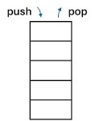
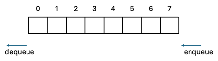

# Study Note: Stack and Queue

## Description
### Stack
- A linear data structure that operates on the Last-In-First-Out (LIFO) or First-In-Last-Out (FILO) principle.
- Elements are added and removed from the same end, referred to as the "top."
- Similar to a stack of plates, where you can only add or remove plates from the top.
- Common operations:
    - **Push**: Add an element to the top.
    - **Pop**: Remove the top element.

### Queue
- A linear data structure that operates on the First-In-First-Out (FIFO) principle.
- Elements are added at one end, called the "rear," and removed from the other end, called the "front."
- Comparable to a line of people waiting, where the first person in line is served first.
- Common operations:
    - **Enqueue**: Add an element to the rear.
    - **Dequeue**: Remove an element from the front.

## Visualization
### Stack

### Queue

## Abstract Data Type

## Implementation
### Array
### Linked List

## Time Complexity

## Space Complexity