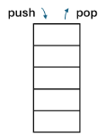

# Study Note: Stack and Queue

## Description

Stack and queue are commonly used to **record and manage the status (or tasks) that still need to be processed**. By controlling the order in which recorded items are retrieved—**LIFO** for stacks and **FIFO** for queues—they help organize “what to proceed next” in many algorithms and systems.

### Stack
- A linear data structure that operates on the Last-In-First-Out (LIFO) or First-In-Last-Out (FILO) principle.
- Elements are added and removed from the same end, referred to as the "top."
- Similar to a stack of plates, where you can only add or remove plates from the top.
- Common operations:
    - **Push**: Add an element to the top.
    - **Pop**: Remove the top element.

### Queue
- A linear data structure that operates on the First-In-First-Out (FIFO) principle.
- Elements are added at one end, called the "rear," and removed from the other end, called the "front."
- Comparable to a line of people waiting, where the first person in line is served first.
- Common operations:
    - **Enqueue**: Add an element to the rear.
    - **Dequeue**: Remove an element from the front.

## Transition: Input/Output Direction

Use the **direction of insertion (input)** and **removal (output)** to move from the abstract idea (Stack/Queue) to concrete implementations (array / linked list).

### Stack: one end only (Top)
- **Input (push)**: at the **top**
- **Output (pop)**: from the **top**
- So both input/output happen at the **same end**.

**Array-based stack**
- `top` index moves in one direction as you push/pop.
- Think of the array “growing” toward increasing indices (or decreasing—either is fine as long as consistent).

**Linked-list-based stack**
- Use the **head as top**:
    - push = insert at head
    - pop = remove from head

---

### Queue: two ends (Rear → Front)
- **Input (enqueue)**: at the **rear**
- **Output (dequeue)**: from the **front**
- So input/output happen at **opposite ends**.

**Array-based queue (circular array)**
- Maintain two indices:
    - `rear` advances on enqueue (input end)
    - `front` advances on dequeue (output end)
- Wrap around using modulo to avoid shifting.

**Linked-list-based queue**
- Maintain two pointers:
    - `tail` = rear (enqueue at tail)
    - `head` = front (dequeue at head)

---

### Quick Summary Table

| Structure | Input end | Output end | Best linked-list mapping |
|---|---|---|---|
| Stack | top | top | head only (top=head) |
| Queue | rear | front | head + tail (front=head, rear=tail) |

## Visualization
### Stack

### Queue

## Abstract Data Type

### Stack (LIFO)

A stack is an abstract data type (ADT) that stores a collection of elements with a single accessible end called the **top**. It follows the **Last-In-First-Out (LIFO)** rule: the most recently inserted element is the first one removed.

The stack ADT supports the following operations:

- **Create**: Initialize an empty stack. Time complexity: \(O(1)\).
- **Push**: Insert an element onto the top. Time complexity: \(O(1)\) (amortized \(O(1)\) for dynamic arrays).
- **Pop**: Remove and return the top element (underflow if empty). Time complexity: \(O(1)\).
- **Top / Peek**: Return (without removing) the top element (error if empty). Time complexity: \(O(1)\).
- **isEmpty**: Check whether the stack contains no elements. Time complexity: \(O(1)\).
- **Size**: Return the number of elements (if maintained). Time complexity: \(O(1)\) (otherwise \(O(n)\)).

**LIFO property**:
- After `push(S, x)`, `top(S) = x`.
- If `S` is non-empty, `pop(S)` returns the most recently pushed element not yet popped.

---

### Queue (FIFO)

A queue is an abstract data type (ADT) that stores a collection of elements with two ends: **rear** (insertion) and **front** (removal). It follows the **First-In-First-Out (FIFO)** rule: the earliest inserted element is the first one removed.

The queue ADT supports the following operations:

- **Create**: Initialize an empty queue. Time complexity: \(O(1)\).
- **Enqueue**: Insert an element at the rear. Time complexity: \(O(1)\) (amortized \(O(1)\) for dynamic arrays).
- **Dequeue**: Remove and return the front element (underflow if empty). Time complexity: \(O(1)\).
- **Front / Peek**: Return (without removing) the front element (error if empty). Time complexity: \(O(1)\).
- **isEmpty**: Check whether the queue contains no elements. Time complexity: \(O(1)\).
- **Size**: Return the number of elements (if maintained). Time complexity: \(O(1)\) (otherwise \(O(n)\)).

**FIFO property**:
- If `x` is enqueued before `y`, then `x` is dequeued before `y`.

## Implementation
- **Array-based**
    - Stack: use an index `top` to track the current top element.
    - Queue: typically use a **circular array** with indices `front` and `rear` to support O(1) enqueue/dequeue.
- **Linked-list-based**
    - Stack: insert/remove at the head for O(1) push/pop.
    - Queue: maintain both head (front) and tail (rear) pointers for O(1) enqueue/dequeue.
- **Underflow/Overflow**
    - Underflow: performing `pop/dequeue` on an empty structure.
    - Overflow: only relevant for fixed-size arrays (when capacity is full).

## Complexity

### Time Complexity
### Time Complexity

#### Stack (LIFO ADT)
| ADT Operation | Array-based (dynamic) | Array-based (fixed capacity) | Linked-list-based |
|---|---:|---:|---:|
| `Push` | Amortized **O(1)** (worst-case **O(n)** on resize) | **O(1)** (may overflow if full) | **O(1)** |
| `Pop` | **O(1)** (may underflow if empty) | **O(1)** (may underflow if empty) | **O(1)** (may underflow if empty) |
| `Top` / `Peek` | **O(1)** (error/underflow if empty) | **O(1)** (error/underflow if empty) | **O(1)** (error/underflow if empty) |
| `isEmpty` | **O(1)** | **O(1)** | **O(1)** |
| `Size` | **O(1)** (if maintained) | **O(1)** (if maintained) | **O(1)** (if maintained; otherwise **O(n)**) |

#### Queue (FIFO ADT)
| ADT Operation | Array-based (circular) | Linked-list-based |
|---|---:|---:|
| `Enqueue` | **O(1)** (fixed capacity; may overflow if full) / Amortized **O(1)** (dynamic; worst-case **O(n)** on resize) | **O(1)** (with tail pointer) |
| `Dequeue` | **O(1)** (may underflow if empty) | **O(1)** (with head pointer; may underflow if empty) |
| `Front` / `Peek` | **O(1)** (error/underflow if empty) | **O(1)** (error/underflow if empty) |
| `isEmpty` | **O(1)** | **O(1)** |
| `Size` | **O(1)** (if maintained) | **O(1)** (if maintained; otherwise **O(n)**) |

> Notes:
> - Dynamic arrays give amortized **O(1)** for `Push`/`Enqueue` but resizing can take **O(n)**.
> - Avoid a non-circular array queue that shifts elements on `Dequeue` (that would be **O(n)** per `Dequeue`).

### Space Complexity

### Stack
- **Array-based**
    - **O(n)** to store `n` elements.
    - **Fixed capacity**: **O(C)** where `C` is the array capacity (may be > `n`).
    - **Dynamic array**: **O(C)** with `C = Θ(n)` typically; may keep extra unused capacity.
- **Linked-list-based**
    - **O(n)** nodes.
    - Additional per-element pointer overhead (e.g., one `next` pointer per node).

### Queue
- **Array-based (circular)**
    - **O(n)** elements stored.
    - **Fixed capacity**: **O(C)**.
    - **Dynamic array**: **O(C)** with `C = Θ(n)` plus possible unused capacity.
- **Linked-list-based**
    - **O(n)** nodes.
    - Per-node pointer overhead (typically one `next` pointer), plus **O(1)** for head/tail pointers.

## Pros and Cons

### Stack

**Pros**
- **Simple and fast**: `push`/`pop`/`peek` are typically **O(1)**.
- **Natural fit for LIFO workflows**: function call stack, undo/redo, backtracking, DFS.
- **Good locality (array-based)**: cache-friendly and low overhead.

**Cons**
- **Restricted access**: can only access the top element (no efficient random access).
- **Overflow/underflow concerns**: overflow with fixed-size arrays; underflow if `pop` on empty.
- **Not suitable for FIFO needs**: awkward for scheduling/buffering tasks in arrival order.

### Queue

**Pros**
- **Fair ordering (FIFO)**: processes items in arrival order; ideal for task scheduling and buffering.
- **Efficient operations**: `enqueue`/`dequeue` are typically **O(1)** (circular array or linked list).
- **Common in systems**: producer–consumer pipelines, BFS, network/IO buffering.

**Cons**
- **Restricted access**: direct access is mainly limited to the front (and sometimes rear).
- **Implementation pitfalls**: non-circular array implementations can degrade to **O(n)** per `dequeue` due to shifting.
- **Capacity/management overhead**: fixed-size queues can overflow; dynamic resizing adds amortized behavior and complexity.

## Variations

### Stack Variations
- **Array-based stack**: Uses a contiguous array and a `top` index (fast, cache-friendly).
- **Linked-list stack**: Each node points to the next (no fixed capacity; extra pointer overhead).
- **Bounded stack**: Fixed maximum size; `push` may overflow.
- **Dynamic stack**: Resizes backing array when needed; `push` is amortized **O(1)**.
- **Two stacks in one array**: Grow two stacks from opposite ends to share capacity efficiently.
- **Min/Max stack**: Supports `getMin()` / `getMax()` in **O(1)** using an auxiliary stack.
- **Monotonic stack**: Maintains increasing/decreasing order; used for “next greater/smaller element” problems.

### Queue Variations
- **Circular queue (ring buffer)**: Array-based queue with wraparound indices to avoid shifting.
- **Deque (double-ended queue)**: Insert/remove at both front and rear in **O(1)**.
- **Priority queue**: Removes highest/lowest priority element first (often heap-based; ops typically **O(log n)**).
- **Bounded queue**: Fixed capacity; enqueue may overflow.
- **Blocking queue**: `enqueue`/`dequeue` may block until space/data is available (common in producer–consumer).
- **Queue via two stacks**: Implements FIFO using two LIFO stacks (amortized **O(1)** per operation).
- **Monotonic queue**: Maintains a monotone order; used for sliding window min/max in **O(n)** total.

