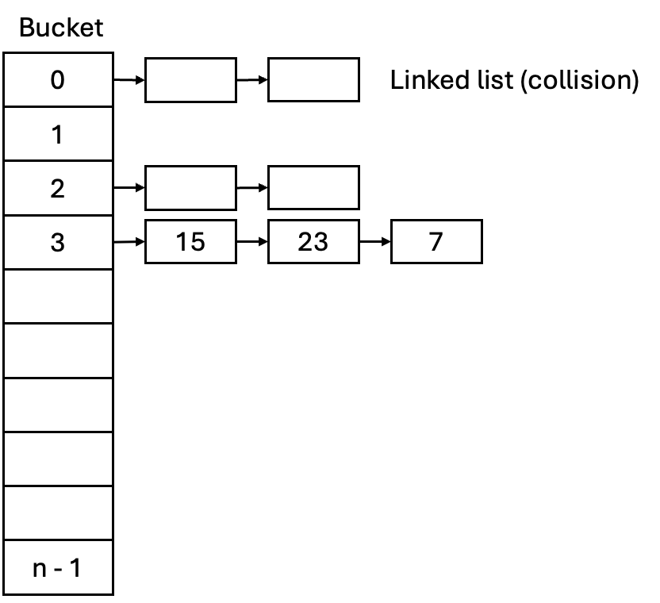

# Study Note: Hash Table

## Description

Hash Table: A key–value data structure that uses a **hash function** to map each key to an index in an underlying array. With a good hash function and controlled **load factor**, hash tables provide **expected \(O(1)\)** time for lookup, insertion, and deletion; however, collisions can occur and are handled via **separate chaining** (lists per bucket) or **open addressing** (probing). In the worst case (many collisions), operations can degrade to **\(O(n)\)**, but in practice hash tables are widely used for fast membership tests and key-based retrieval.

## Transition: From Arrays with Linked Lists to Hash Table

A **hash table** can be understood as a natural evolution of two simpler ideas:

1. **Arrays** give fast access **if** you already know the correct index.
2. **Linked lists** make insertion/removal easy, but searching is **linear**.

### Step 1: Start with an array, but indexing is the problem
In an array, access is efficient:

- read/write by index: **\(O(1)\)**

But if your data is keyed (e.g., `"alice" -> 123`), you usually **don’t know** the index for a key.  
A naive solution is to store `(key, value)` pairs in an array and scan:

- lookup: **\(O(n)\)**

### Step 2: Use an array of buckets (each bucket is a linked list)
To avoid scanning the entire array, we divide data into **buckets**.

- Create an array `buckets[0..m-1]`
- Each `buckets[i]` points to a linked list of entries that belong to that bucket

This is essentially **separate chaining**:

- lookup/insert/delete within one bucket: **\(O(\text{bucket length})\)**

### Step 3: Add a hash function to choose the bucket
Now we need a rule to map a key to a bucket index:

\[
index = h(key) $\bmod$ m
\]

- `h(key)` is the **hash function**
- `m` is the number of buckets (array size)

So the process becomes:

1. Compute `index`
2. Go to `buckets[index]`
3. Search/insert in that linked list

### Why this becomes efficient (expected \(O(1)\))
If the hash function spreads keys evenly, each bucket stays small.  
Let:

\[
$\alpha$ = $\frac{n}{m}$
\]

where `n` is #entries and `m` is #buckets. `\(\alpha\)` is the **load factor** (expected bucket length).

- expected lookup/insert/delete: **\(O(1 + \alpha)\)**  
- if we keep `\(\alpha\)` bounded (by resizing/rehashing), operations become **expected \(O(1)\)**

### The key idea
A hash table is:

- an **array** (for fast bucket access), plus
- a **mapping rule** (hash function), plus
- a **collision strategy** (often linked lists per bucket)

So you can think of it as **“array-of-linked-lists + hash(key)”** to get fast key-based access.

## Visualization



## Abstract Data Type

A hash table is an abstract data type (ADT) that represents a **key–value map**. It uses a **hash function** to translate a key into a bucket/index and resolves collisions (e.g., by separate chaining or open addressing). The hash table ADT supports the following operations:

- **Insert / Put**: Add a new `(key, value)` pair. If `key` already exists, update its value. Expected time complexity: \(O(1)\); worst case: \(O(n)\).
- **Lookup / Get**: Retrieve the value associated with `key` (or report not found). Expected time complexity: \(O(1)\); worst case: \(O(n)\).
- **Update**: Modify the value of an existing `key`. Expected time complexity: \(O(1)\); worst case: \(O(n)\).
- **Delete / Remove**: Remove the entry for `key` if present. Expected time complexity: \(O(1)\); worst case: \(O(n)\).
- **Contains**: Test whether a `key` exists. Expected time complexity: \(O(1)\); worst case: \(O(n)\).
- **Traversal / Iteration**: Visit all stored `(key, value)` entries (order unspecified). Time complexity: \(O(n)\).
- **Resize / Rehash**: Rebuild the table with a new capacity to keep the load factor bounded. Time complexity: \(O(n)\).

Hash tables are widely used due to their fast expected performance for key-based retrieval and updates.

## Design of Hash Function

A **hash function** maps a key to an integer so we can choose a bucket/index:

\[
index = h(key) \bmod m
\]

A good hash function aims for:

- **Determinism**: same key \(\rightarrow\) same hash every time.
- **Uniformity**: keys spread evenly across buckets to reduce collisions.
- **Efficiency**: fast to compute (hashing shouldn’t dominate runtime).
- **Low correlation**: small changes in input should significantly change the hash.

### Common techniques
- **Integer keys**:
    - **Multiplicative hashing**: \(h(x) = (x \cdot A)\) then take high bits (common in practice).
    - **Modulo hashing**: \(h(x)=x \bmod m\) (simple, but choose \(m\) carefully).
- **String keys** (polynomial rolling idea):
    \[
    h(s) = \sum_{i=0}^{k-1} s[i]\cdot p^i \pmod m
    \]
    (often implemented iteratively to avoid overflow).

### Choosing table size \(m\)
- For **separate chaining**, many implementations choose \(m\) as a **prime** or a well-spaced growth sequence.
- For **open addressing**, a common choice is **power of two** (fast masking), but then the hash should mix bits well so low bits are not biased.

## Collision Resolution Strategies

A **hash table** stores `(key, value)` entries in an array of size \(m\). Because multiple keys may map to the same index, it needs a **collision resolution** strategy.

Let \(n\) be the number of stored entries and define the **load factor**:

\[
$\alpha$ = $\frac{n}{m}$
\]

### Separate Chaining

Each array slot (bucket) holds a **collection** of entries (commonly a linked list; sometimes a small dynamic array).

**How it works**
- **Insert**: compute `index = h(key) mod m`, then add the entry to bucket `index`.
- **Lookup / Delete**: compute the bucket, then scan that bucket to find the key.

**Cost**
- Expected bucket length is \($\alpha$\)
- Expected time per operation: \($\;O$(1+$\alpha$)\)

**Pros**
- Deletion is straightforward
- Performance degrades *gracefully* as \($\alpha$\) grows

**Cons**
- Extra memory overhead (pointers / per-node allocation)
- Often worse cache locality than array-only approaches

### Open Addressing

All entries are stored **directly in the array**. If a collision occurs, the table searches for another slot using a **probe sequence**.

**Probe strategies**
- **Linear probing**: try \(i, i+1, i+2, $\dots$\)  
    - simple and cache-friendly  
    - can suffer from **primary clustering**
- **Quadratic probing**: try \(i+1^2, i+2^2, $\dots$\) (mod \(m\))  
    - reduces primary clustering vs. linear probing  
    - can still cause **secondary clustering**
- **Double hashing**: step size comes from a second hash function  
    - typically best distribution among these methods  
    - more computation per probe

**Deletion**
- Usually uses a **tombstone** marker so probe chains remain searchable.

**Load factor rule of thumb**
- Keep \($\alpha$\) below a safe threshold (commonly \($\alpha$ < 0.7\)) to maintain short probe sequences.

### Clustering in Open Addressing

A key drawback of open addressing is **clustering**: groups of occupied slots form, making future probes longer (slower inserts/lookups).

#### Primary clustering (linear probing)
With linear probing, once a contiguous run of occupied slots forms, new keys hashing into that run tend to extend it.

- Result: probe lengths increase rapidly as \($\alpha$\) grows, even with a decent hash function.

#### Secondary clustering (quadratic probing)
With quadratic probing, keys that start at the same initial index follow the **same probe sequence**.

- Result: fewer long contiguous runs than linear probing, but repeated collisions for keys with the same start index.

#### Double hashing (mitigation)
Double hashing varies the step size per key, so even keys with the same initial index are more likely to diverge.

- Result: reduces both primary and secondary clustering; often the best of the classic probing methods.

**Practical guidance**
- keep \($\alpha$\) modest (often \(0.5\)–\(0.7\)),
- use a well-mixed hash function,
- consider double hashing (or variants like Robin Hood hashing) when probe length is critical.

## Complexity

Let \(n\) be the number of stored entries, \(m\) the number of buckets/slots, and \($\alpha$ = n/m\).

### Time Complexity
- **Expected** (good hashing, controlled \($\alpha$\)):
    - Insert / Lookup / Delete: **\(O(1)\)** (more precisely \(O(1+$\alpha$)\) for chaining; expected constant probes for open addressing under a safe load factor)
- **Worst case** (pathological collisions / adversarial inputs):
    - Insert / Lookup / Delete: **\(O(n)\)**
- **Resize / Rehash**:
    - **\(O(n)\)** when resizing occurs, but can be **amortized \(O(1)\)** per insertion if growth is geometric.

### Space Complexity
- **Separate chaining**: \(O(m + n)\) (array of buckets + nodes)
- **Open addressing**: \(O(m)\) slots, with \(m = $\Theta$(n)\) when load factor is bounded, so overall **\(O(n)\)**

---

## Pros & Cons

### Pros
- **Fast expected performance** for search/insert/delete (often near constant time).
- **Flexible keys** (strings, numbers, structs) as long as they can be hashed.
- Great for:
    - membership tests (sets)
    - indexing / dictionaries (maps)
    - counting frequencies

### Cons
- **Worst-case \(O(n)\)** if many collisions occur (poor hash, adversarial keys).
- **Resizing cost**: rehashing can cause latency spikes (though amortized small).
- **No ordering**: iteration order is typically unspecified (unlike balanced BSTs).
- **More complex deletion** in open addressing (tombstones) and potential clustering effects.
- Requires careful tuning of **hash function** and **load factor** for best performance.

## Two Sum

> Origin: LeetCode — [Two Sum](https://leetcode.com/problems/two-sum/)

### Problem
Given an integer array `array` and an integer `target`, find **two different indices** `i` and `j` such that:

\[
array[i] + array[j] = target,\quad i \ne j
\]

Return the indices (or report not found).

---

### Approach 1: Brute Force (Two Loops)
Check all pairs `(i, j)`.

- **Time**: \(O(n^2)\)  
- **Space**: \(O(1)\)

```c
#include <stdio.h>

int two_sum_bruteforce(const int array[], int n, int target, int *out_i, int *out_j) {
    for (int i = 0; i < n; i++) {
        for (int j = i + 1; j < n; j++) {
            if (array[i] + array[j] == target) {
                *out_i = i;
                *out_j = j;
                return 1; // found
            }
        }
    }
    return 0; // not found
}
```

---

### Approach 2: Hash Table (One Pass, Expected O(n))
Use a hash table to store previously seen values and their indices.  
For each `array[i]`, compute `need = target - array[i]`. If `need` already exists, return its index and `i`.

- **Time**: expected \(O(n)\)  
- **Space**: \(O(n)\)

> Note: This is a minimal C implementation using open addressing (linear probing).

```c
#include <stdio.h>
#include <stdlib.h>

typedef struct {
    int key;      // array value
    int value;    // index in array
    int used;     // 0 = empty, 1 = occupied
} Entry;

static unsigned hash_int(int x) {
    // simple integer hash
    return (unsigned)x * 2654435761u;
}

static int ht_put(Entry *t, int cap, int key, int value) {
    int start = (int)(hash_int(key) % (unsigned)cap);
    for (int k = 0; k < cap; k++) {
        int idx = (start + k) % cap;
        if (!t[idx].used) {
            t[idx].used = 1;
            t[idx].key = key;
            t[idx].value = value;
            return 1;
        }
        // keep first index for duplicates; do nothing if key already exists
        if (t[idx].key == key) return 1;
    }
    return 0;
}

static int ht_get(Entry *t, int cap, int key, int *out_value) {
    int start = (int)(hash_int(key) % (unsigned)cap);
    for (int k = 0; k < cap; k++) {
        int idx = (start + k) % cap;
        if (!t[idx].used) return 0; // stop at empty slot
        if (t[idx].key == key) {
            *out_value = t[idx].value;
            return 1;
        }
    }
    return 0;
}

int two_sum_hash(const int array[], int n, int target, int *out_i, int *out_j) {
    // capacity ~ 2n for lower collision rate
    int cap = 1;
    while (cap < 2 * n) cap <<= 1;

    Entry *table = (Entry *)calloc((size_t)cap, sizeof(Entry));
    if (!table) return 0;

    for (int i = 0; i < n; i++) {
        int need = target - array[i];
        int j;
        if (ht_get(table, cap, need, &j)) {
            *out_i = j;
            *out_j = i;
            free(table);
            return 1;
        }
        ht_put(table, cap, array[i], i);
    }

    free(table);
    return 0;
}
```

---

### Example Usage
```c
int main(void) {
    int array[] = {2, 7, 11, 15};
    int target = 9;
    int i, j;

    if (two_sum_hash(array, 4, target, &i, &j)) {
        printf("Found: i=%d, j=%d (array[i]=%d, array[j]=%d)\n", i, j, array[i], array[j]);
    } else {
        printf("No solution\n");
    }
    return 0;
}
```

## Variations

- **Separate Chaining Hash Table**: Each bucket stores a *collection* of entries (often a linked list; sometimes a dynamic array or balanced BST). Collisions stay inside the bucket, and performance is \(O(1+$\alpha$)\) expected.
- **Open Addressing Hash Table**: All entries live directly in the array. Collisions are resolved by probing (linear/quadratic/double hashing). Needs careful handling of deletion (tombstones) and a bounded load factor.
- **Robin Hood Hashing (open addressing variant)**: During insertion, entries with a larger probe distance can “steal” slots from entries with a smaller probe distance, reducing variance in lookup times (more predictable probes).
- **Cuckoo Hashing**: Uses two (or more) hash functions and allows an entry to reside in one of several possible locations. Insertions may trigger evictions (“kicking out” existing keys) and occasional rebuilds, but lookups are typically \(O(1)\) worst-case (constant number of checks).
- **Hopscotch Hashing**: An open-addressing scheme that keeps keys close to their home bucket (within a neighborhood), improving cache locality and often supporting high load factors.
- **Dynamic / Resizing Hash Table (Rehashing)**: Automatically grows (and sometimes shrinks) when the load factor crosses thresholds. Rebuild cost is \(O(n)\), but insertion remains **amortized** \(O(1)\) with geometric growth.
- **Perfect Hashing (static sets)**: Precomputes a hash function (or two-level scheme) with *no collisions* for a fixed key set, enabling worst-case \(O(1)\) lookup (common in compilers or read-only dictionaries).
- **Extendible / Linear Hashing (disk-friendly)**: Hash tables designed for external memory (databases/filesystems), where buckets can split incrementally without rebuilding the entire table at once.
